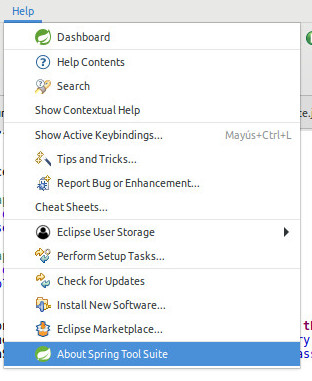
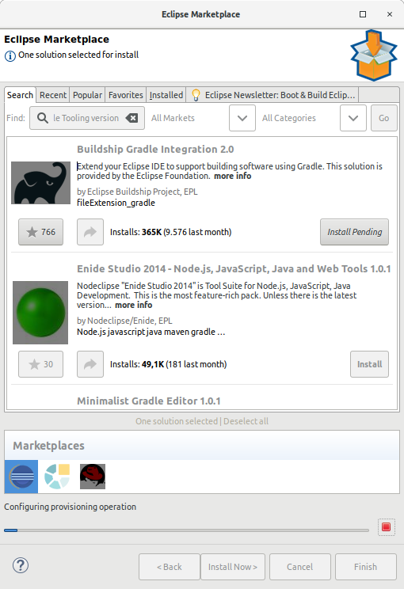
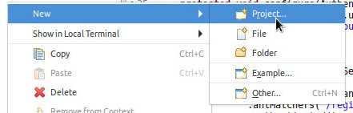
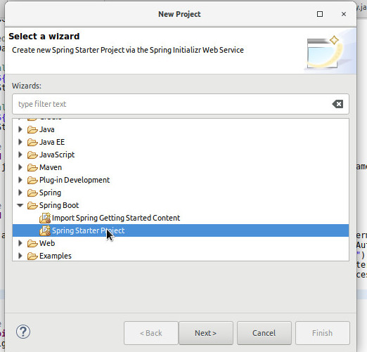
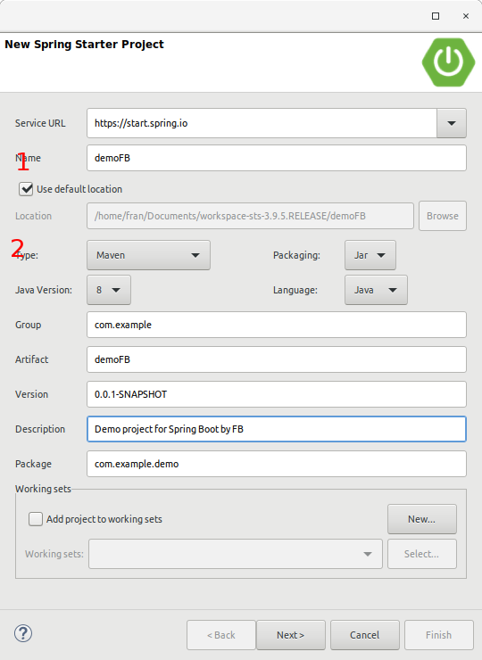
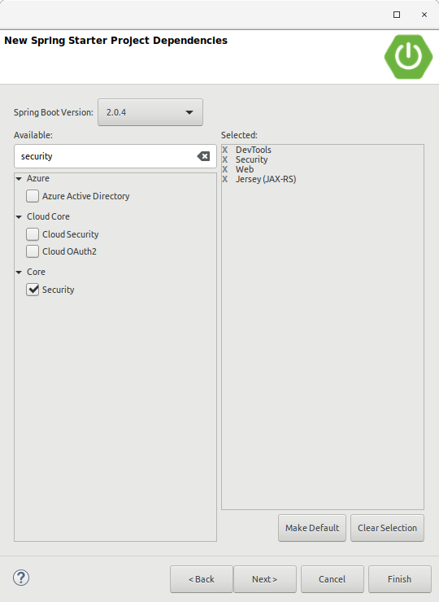
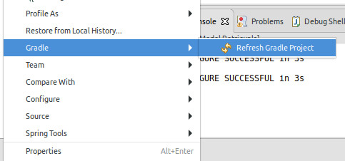
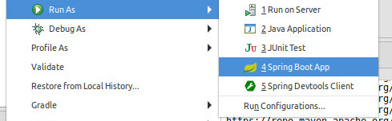
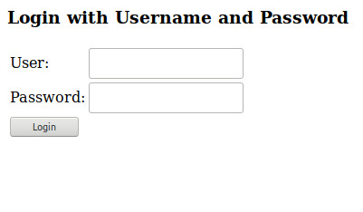
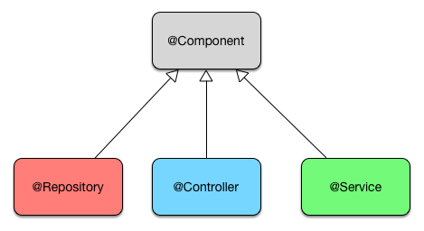

# Spring Boot + authentication + RestFul tutorial

In this tutorial we will see how to use Spring boot to generate a project that has users with roles and authentication. We will also have RestFul to get data.
The page will have a Login page, Logout, create user, a different home page according to the role of the user and the possibility of obtaining data median RestFul.


## Table of Contents
 - [Getting Started](#getting-started)
 - [Prerequisites](#prerequisites)
 - [Installing](#installing)
 - [Adding functionality](#adding-functionality)
 	- [Database config](#database-config)
	- [Java code](#java-code)
		- [Annotations](#java-code)
			- [Entity](#entity)
			- [Repository](#repository)
			- [Configuration of the REST service](#configuration-of-the-rest-service)
			- [Service](#service)
	- [Structure of the project](#structure-of-the-project)
	- [How LOGIN HTML works](#how-login-html-works)
	- [Registration html](#registration-html)
	- [IMPORT SQL](#import-sql)
 - [Tests](#tests)


## Getting Started

These instructions will get you a copy of the project up and running on your local machine for development and testing purposes.

### Prerequisites
* Knowledge of Java and html
* [Spring Tool Suite](https://spring.io/tools/)
* A running MySQL engine.
You can use [AMPPS](https://www.ampps.com/download) as engine and [mysql workbench](https://www.mysql.com/products/workbench/) to make queries.

### Installing

Once installed the Spring Tool Suite, install the plugin "Buildship Gradle Tooling version 2.0" for it go to the HELP → Eclipse Marketplace and look for Buildship Gradle Tooling version 2.0
This Plugin allows us to work with Gradle.

* To install the plug-in:


and



You must create a new Spring project.
To do this, right click on the left panel of the suite.



And we configure as follows:



Where:

* 1 It is the name of the project
* 2 Change Maven by Gradle 2.X

Press NEXT and select the libraries that we are going to use, in this case they are:



The libraries that we need are:

* jpa
* security
* thymeleaf
* web
* jersey
* devtools
* mysql

Press FINISH when we have all the libraries.

We have created the project.
At the root of the project, we look for the BUILD.GRADLE file and open it to control and see if we have the libraries.

We should be able to see the following:
```bash
dependencies {
	compile('org.springframework.boot:spring-boot-starter-data-jpa')
	compile('org.springframework.boot:spring-boot-starter-security')
	compile('org.springframework.boot:spring-boot-starter-thymeleaf')
	compile('org.springframework.boot:spring-boot-starter-web')
	compile('org.springframework.boot:spring-boot-starter-jersey')
	runtime('org.springframework.boot:spring-boot-devtools')
	runtime('mysql:mysql-connector-java')
	testCompile('org.springframework.boot:spring-boot-starter-test')
	testCompile('org.springframework.security:spring-security-test')
} 
```

This is  Gradle configuration that downloads the necessary libraries. 
If in the future we need to add more libraries or need to change the version or delete, we must modify this configuration.
Once the configuration has been modified so that the changes take effect on the necessary libraries, we right click on the root of the created project and go GRADLE → REFRESH GRADLE PROJECT



Now you must create a SCHEMA in the MySQL database. The name of the schema, for example "springSecurityDemo"

Once the SCHEMA "springSecurityDemo" is created, we go to the APPLICATION.PROPERTIES file and add the following lines:

```bash
spring.datasource.url = jdbc:mysql://localhost:3306/springSecurityDemo
spring.datasource.username = username
spring.datasource.password = password
```

Where username and password are the user and password to access the database.

To check that the environment run fine, let's Run AS and select SPRING BOOT APP



Open a browser and go to the url:
http://localhost:8080

If a screen similar to this one is loaded, we are fine:


## Adding functionality

Now we are going to add functionality to the project.

### Database config

Edit the APPLICATION.PROPERTIES file again, add the following information.

```bash
#These variables contain the necessary queries for the login, search the user and the role.
spring.queries.userquery=select email, password, active from user where email=?
spring.queries.rolequery=select u.email, r.role from user u inner join user_role ur on(u.user_id=ur.user_id) inner join role r on(ur.role_id=r.role_id) where u.email=?
#Definen the type of log that is made.
logging.pattern.console=%d{yyyy-MM-dd HH:mm:ss} %-5level %logger{36} - %msg%n
logging.level.org.hibernate.SQL=debug
#Hibernate creates what it need in the database schema. WARNING, this line must not pass a production environment. Any Entity that is defined in our project will be created, being able to do a great damage to our project in a production environment.
spring.jpa.hibernate.ddl-auto=create
#Configuration for Hibernate to use a dialect compatible with version 5.
spring.jpa.properties.hibernate.dialect = org.hibernate.dialect.MySQL5Dialect
# Every SQL query that Hibernet makes, will be displayed by Log in SQL format.
spring.jpa.show-sql = true
```

### Java code

It is time to create the JAVA files and the structure of the project.
We will explain some ANNOTATIONS, both Spring and Java.
The annotations are defined with @ at the beginning.

From Spring's annotations, the most important are:



@Component is a generic StereoType for any component of Spring.
@Repository, component responsible for persistence layer management (DAO.
@Controller, usually accompanied by @RequestMapping, the controller is used to define the class that is going to be controller, that is, it is responsible for managing the data model and the views.
@Service, component responsible for handling the Service layer.

@Configuration
Annotation of Spring that is used to define the configuration files.

@Autowired
Spring annotation for code injection. This means that Spring is the one who creates the objects when they are necessary.
 
@Value ("$ {VALUE DEFINED IN APPLICATION.PROPERTIES}")
Spring Annotation where the variable takes the value defined in the application.properties file
 
@RequestMapping
Annotation Spring where is responsible for making a union between the view and controller. The controller defines whether it is a POST or GET.
In the view (the HTML) the tag TH: ACTION is in charge of making the call to the controller.
In some cases we find the TH: OBJECT tag, this tag defines the object that we will use when making the ACTION. It is not mandatory and is only used when we must send something from the view to the controller.
In our example, the REGISTRATION.HTML view has an ACTION that goes to REGISTRATION and sends a USER object. To complete the USER object, TH: FIELD is used. Following the same example, we see how it is completed with EMAIL, NAME, LASTNAME, etc.


@EnableWebSecurity
Annotation from Spring Security that gives Spring a configuration about WebSecurityConfigurerAdapter.


### Entity 
It is an object that has the same structure as a data in the database. It allows us to work with the database using objects.
The entity will be formed as follows:
@Entity
Java Persistence annotation where you define that the class is an entity.

@Table (name = "role")
Java Persistence annotation where you define the name of the table, in this case the table is called ROLE

@Id
Java Persistence annotation where it is defined that the variant will be ID.

@GeneratedValue (strategy = GenerationType.AUTO)
Java Persistence annotation where it is defined that the variable ID is going to be auto incremental.

@Column (name = "role_id")
Java Persistence annotation where the object's ID relationship is defined works against role_id in the database.


### Repository
@Repository ("roleRepository")
Annotation of Spring where it is indicated that it is a DAO, this means that it will work in the persistence layer.


### Configuration of the REST service
@ApplicationPath ("/rest")
Annotation of Rs indicating that, in our example, URL / REST we will have access to the rest service.

@PostConstruct
There can only be one PostConstruct in the class. With each instance it forces the method where the annotation is to be executed.

@Path ("/role")
Rs annotation that sets the route for the REST, in our case it would be /rest/role

@GET
Rs annotation where the REQUEST is configured through a GET

@Produces ("application / json")
Rs annotation where it indicates that the returned response goes in JSON format

@Path ("/{role}")
Annotation of Rs where it indicates that it expects a variable that is called "role" and in the method it will have the assignment of this variable. Example of assignment in one method:
public Role findRole (@PathParam ("role") String roleString) {...}
The findRole method, the roleString variable of type STRING receives as the value of the variable "role" defined in PathParam


### Service
@Service ("roleService")
Annotation of Spring indicating that it is a bean of the business layer.

## Structure of the project

Create the following packages:

* configuration
* controller
* model
* repository
* service


Configuration Package.
This package will have the related files (in this example) to the configuration of the services (security and Restful).
Create the files:

* JerseyConfig.java
* WebMvcConfig.java
* SecurityConfiguration.java


### Controller package

This package will have the controllers. In this simple example we only have one but there may be as many as you need.
* MainController.java


### Model package

* Role.java
* User.java


### Repository package

* RoleRepository
* UserRepository


### Service package

* RoleService.java
* RoleServiceImpl.java
* UserService.java
* UserServiceImpl.java


### Resources
Inside the Main/Resources package we are going to create

* templates
and inside templates we create
* admin

Inside the templates package we will have the general access html, for any user. In the ADMIN package we will only put the html that the ADMIN will have access to.
Inside the templates package we find the following files
* 403.html
* error.html
* home.html
* login.html.
* registration.html

Inside the templates.admin package we find
* home.html

### How LOGIN HTML works

It has 2 input fields defined, the email and the password. By pressing the Login button, this generates a submit that is caught by the configure (HttpSecurity http) method of the SecurityConfiguration class.
In this method, the values set in the email and password fields are retrieved. With these data is authorized and sent to the home page but this page is mapped in the MainController in the home () method, so it is captured by this method that is the one that validates the existence of the mail and according to the role goes to the desired page.

### Registration html

When the Create button is pressed, it is called th: action who uses th: object = "$ {user}" creating an object of type USER using the data that is defined th: field = "* XX". For example th: field = "* {name}"

### IMPORT SQL
It is an SQL file for data import.
The IMPORT.SQL file, which exists in the project, contains SQLs that are used to pre-load data in the table. In this example, it serves to create roles and user.
Keep in mind that this SQL is executed every time the project is started, so in Production environments it is recommended to delete.

### Tests
First, check that the MySQL engine is running.
Second, Start the project. Right button on the name of the project, RUN AS, SPRING BOOT APP

To check the project enter
http://localhost:8080/home
user: admin@admin.com
pass: admin12345

To check REST service (you must be authorized)
http://localhost:8080/rest/role/ADMIN
ADMIN is a ROLE

If you want to test the USER role, you must create a new user.


